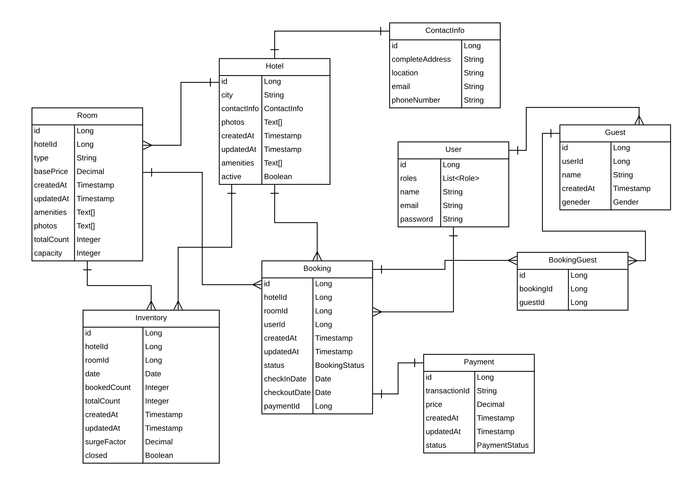
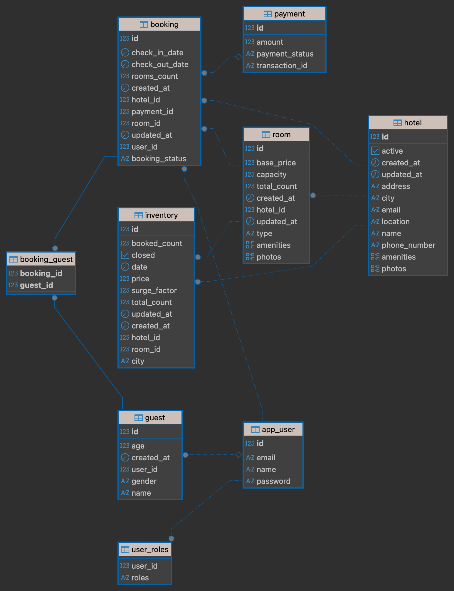
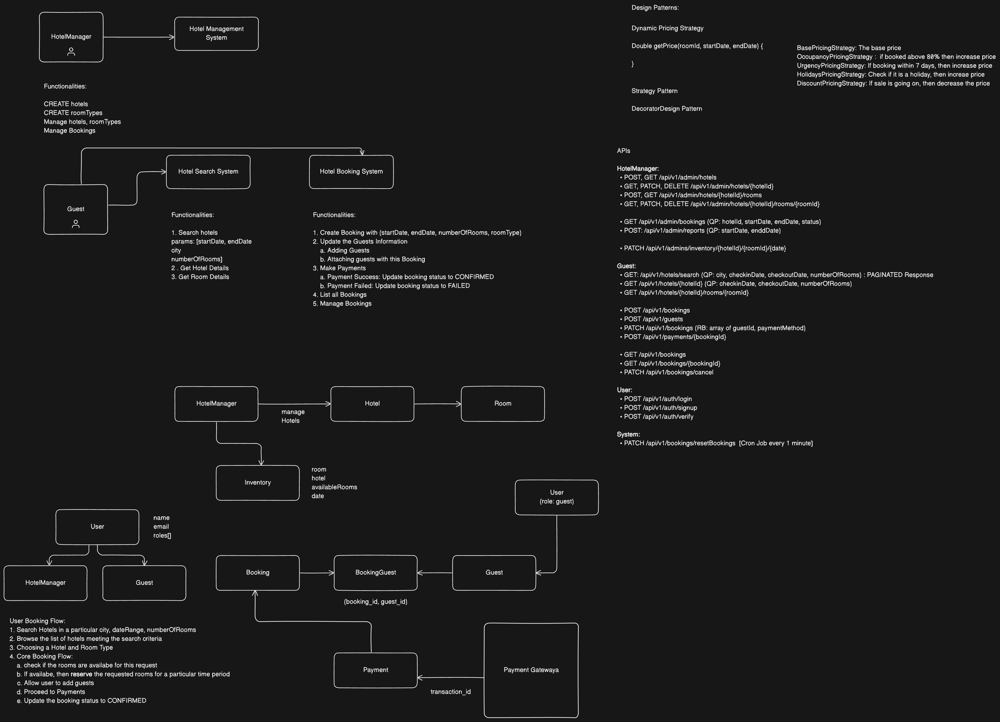

# 🏨 AirBnB Backend (Spring Boot + PostgreSQL)

A backend system that mimics the core functionality of Airbnb: managing hotels, rooms, bookings, guests, inventory, and payments.

---

## ⚡ Features (Implemented)

* **Hotel & Room management**
* **Guest management**
* **User authentication with roles** (`HotelManager`, `Guest`)
* **Booking system** with guests and payments
* **Inventory tracking** with surge pricing
* **Payment integration (Stripe)**
* **Enum-based Role & Status management**
* **Dynamic Pricing Engine (Strategy Pattern)**

    * Base Pricing
    * Surge Pricing
    * Occupancy-based Pricing
    * Urgency-based Pricing
    * Holiday Pricing
* **Scheduled Price Updates**

    * Recalculates inventory prices every hour
    * Updates minimum hotel price per day for faster search

---

## 📐 System Design

### Data Flow Diagram (DFD)

 

### Database View (DBeaver)



### High-Level Architecture



---

## 🛠 Tech Stack

* **Backend:** Spring Boot
* **ORM:** JPA / Hibernate
* **Database:** PostgreSQL
* **Utilities:** Lombok
* **Build Tool:** Maven

---

## 🗂 Controllers & Endpoints

# 📦 API Testing (Postman)

You can test all backend APIs using the provided Postman collection.

### Collection File

`AirBnb.postman_collection.json` (included in this repository)

### Import Instructions

1. Open Postman.
2. Click **Import → File** and select `AirBnb.postman_collection.json`.
3. All endpoints (Admin Hotels, Rooms, Booking, Auth, Inventory, User) will be available for testing.

---

### **1. ADMIN Hotels**

* `POST /api/v1/admin/hotels` → Create Hotel
* `GET /api/v1/admin/hotels` → Get All Hotels
* `GET /api/v1/admin/hotels/{hotelId}` → Get Hotel By ID
* `PUT /api/v1/admin/hotels/{hotelId}` → Update Hotel
* `DELETE /api/v1/admin/hotels/{hotelId}` → Delete Hotel
* `PATCH /api/v1/admin/hotels/{hotelId}/activate` → Activate Hotel
* `GET /api/v1/admin/hotels/{hotelId}/bookings` → Get All Bookings for Hotel
* `GET /api/v1/admin/hotels/reports` → Generate Report

### **2. ADMIN Rooms**

* `POST /api/v1/admin/hotels/{hotelId}/rooms` → Create Room
* `GET /api/v1/admin/hotels/{hotelId}/rooms` → Get All Rooms in a Hotel
* `GET /api/v1/admin/hotels/{hotelId}/rooms/{roomId}` → Get Room By ID
* `PUT /api/v1/admin/hotels/{hotelId}/rooms/{roomId}` → Update Room

### **3. Booking**

* `GET /api/v1/hotels/search` → Search Hotels
* `GET /api/v1/hotels/{hotelId}/info` → Hotel Details
* `POST /api/v1/bookings/init` → Initialize Booking
* `POST /api/v1/bookings/{bookingId}/addGuests` → Add Guests to Booking
* `POST /api/v1/bookings/{bookingId}/payments` → Initialize Payment
* `POST /api/v1/bookings/{bookingId}/cancel` → Cancel Booking

### **4. Auth**

* `POST /api/v1/auth/signup` → User Signup
* `POST /api/v1/auth/login` → User Login
* `POST /api/v1/auth/refresh` → Refresh JWT Token

### **5. ADMIN Inventory**

* `GET /api/v1/admin/inventory/rooms/{roomId}` → Get Inventory By Room ID
* `PATCH /api/v1/admin/inventory/rooms/{roomId}` → Update Inventory

### **6. User**

* `GET /api/v1/users/profile` → Get My Profile
* `PATCH /api/v1/users/profile` → Update My Profile

**💡 Notes:**

* All protected endpoints require JWT authentication.
* Use the provided bearer token in Postman to access these endpoints.

---

## ⚙️ Setup Guide

1. **Clone the repository**

   ```bash
   git clone https://github.com/ashwinbharadwaj16/AirBnb-Backend.git
   cd AirBnb-Backend
   ```

2. **Configure Database**
   Edit `src/main/resources/application.properties`:

   ```properties
   spring.datasource.url=jdbc:postgresql://localhost:5432/airbnb
   spring.datasource.username=postgres
   spring.datasource.password=yourpassword
   spring.jpa.hibernate.ddl-auto=update
   spring.jpa.show-sql=true
   ```

3. **Run the application**

   ```bash
   ./mvnw spring-boot:run
   ```

---

## 🚀 Development Workflow

### **1. Project Setup**

* Initialize Spring Boot project with dependencies (Web, JPA, Validation, Lombok)
* Configure DB connection and run the app to verify DB connection

### **2. Project Structure & Entities**

* Define packages: `controller`, `service`, `repository`, `dto`, `exception`, `security`, `config`
* Create entities: `Hotel`, `Room`, `User`, `Booking`, `Inventory`, etc.
* Map relationships: `OneToMany`, `ManyToOne`, etc.
* Create repositories and DTOs

### **3. Business Logic Layer**

* Implement services for core business logic
* Write controllers (`HotelController`, `RoomController`)
* Implement exceptions:

    * `ResourceNotFoundException`
    * `ApiError`, `ApiResponse`
    * `GlobalExceptionHandler`, `GlobalResponseHandler`

### **4. Inventory & API Testing**

* Implement `Inventory` logic
* Test APIs continuously (watch for DB constraints: unique, nullable, duplicates)

### **5. Search & Booking**

* Create `HotelBrowseController`
* Implement search and booking functionalities

### **6. Dynamic Pricing**

* Decorator Design Pattern for dynamic pricing strategies:

    * Base Pricing, Surge Pricing, Occupancy-based, Urgency-based, Holiday Pricing
* ⚠️ Note: `@NoArgsConstructor` cannot be used with `private final PricingStrategy`

### **7. Security Implementation**

* Add Spring Security + JWT dependencies
* Implement `UserDetails` in `User` entity (`getAuthorities()`, `getUsername()`)
* Create `security` package for JWT, filters, and config
* `JWTService` and `JWTAuthFilter` are generic and reusable
* WebSecurityConfig defines public vs authenticated routes
* AuthService implements `login`, `signup`, `refreshToken`
* Exception handling for JWT and Spring Security context

### **8. Stripe Payment Gateway**

* Add Stripe dependency
* Implement checkout service and routes in `HotelBookingController`
* Configure Stripe API key in `application.properties`
* Connect to Stripe CLI and implement webhook controller
* Implement locking on `findAndReserveInventory` and `Bookings`
* Hide API keys before pushing to GitHub

---

## 📓 Notes / Learnings

* Spring Security exceptions must be explicitly passed to `RestControllerAdvice`
* Decorator Pattern is ideal for extending pricing logic dynamically

---

## 👨‍💻 Author

* **Ashwin Bharadwaj**(https://github.com/ashwinbharadwaj16)
